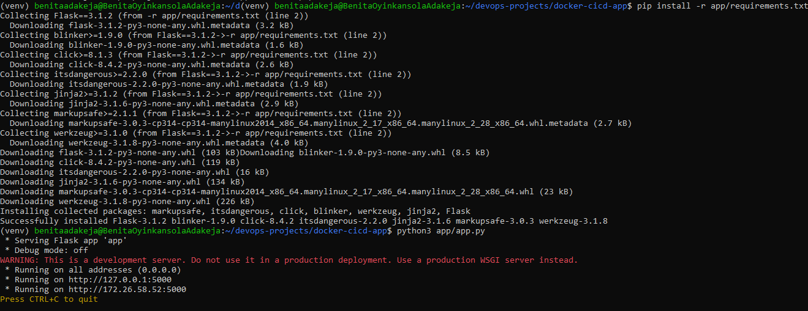
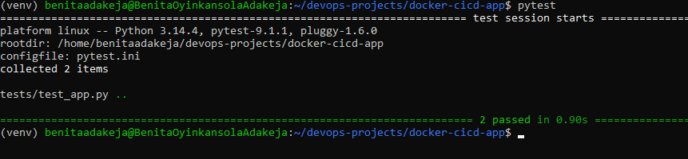
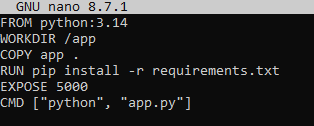
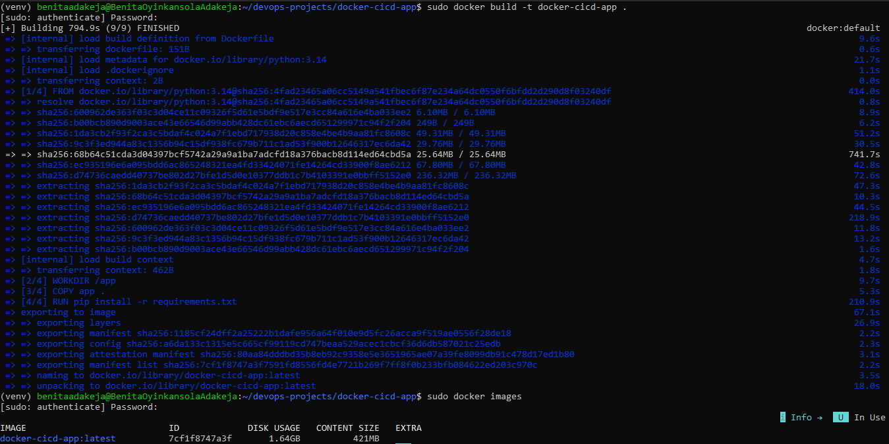
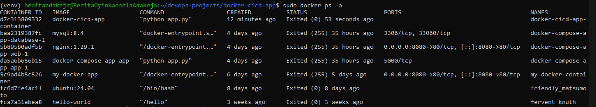
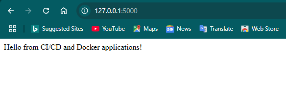
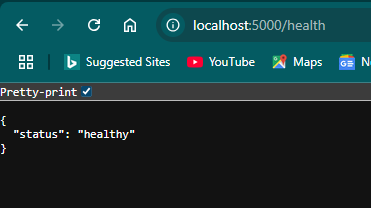
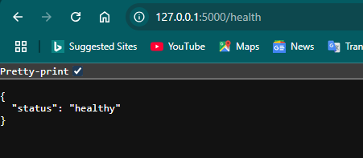
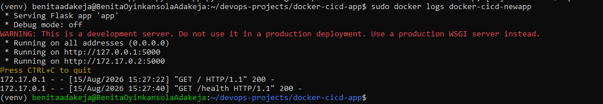

# Docker CI/CD App

A containerized Flask application with automated testing and a GitHub Actions CI/CD pipeline that builds and publishes Docker images to GitHub Container Registry (GHCR).


---

## 📌 Project Overview

This project demonstrates a complete beginner-friendly **CI/CD workflow using Docker and GitHub Actions**.

The application is a simple Flask API with two endpoints:

* `/` — returns a welcome message
* `/health` — returns the application's health status

The application is:

1. Developed with Flask
2. Tested automatically with `pytest`
3. Containerized with Docker
4. Built automatically by GitHub Actions
5. Published to GitHub Container Registry (GHCR)
6. Pulled back from GHCR and run as a Docker container

The project was built as part of my hands-on DevOps learning journey.

---

## 🏗️ Architecture

```text
                     Developer
                         │
                         │ git push
                         ▼
                  GitHub Repository
                         │
                         ▼
                  GitHub Actions
                         │
              ┌──────────┴──────────┐
              │                     │
              ▼                     ▼
        Run automated tests    Build Docker image
              │                     │
              └──────────┬──────────┘
                         │
                         ▼
                Push image to GHCR
                         │
                         ▼
              GitHub Container Registry
                         │
                         │ docker pull
                         ▼
                 Docker Container
                         │
                         ▼
                   Flask App
                    /       \
                   /         \
                  ▼           ▼
                 /          /health
```

---

## 🛠️ Technologies Used

| Technology                | Purpose                      |
| ------------------------- | ---------------------------- |
| Python 3.14               | Application runtime          |
| Flask 3.1.2               | Web framework                |
| Pytest                    | Automated testing            |
| Docker                    | Application containerization |
| Git                       | Version control              |
| GitHub                    | Source code hosting          |
| GitHub Actions            | CI/CD automation             |
| GitHub Container Registry | Docker image storage         |
| Ubuntu / WSL              | Development environment      |

---

## 📁 Project Structure

```text
docker-cicd-app/
│
├── .github/
│   └── workflows/
│       └── ci.yml
│
├── app/
│   ├── __init__.py
│   ├── app.py
│   └── requirements.txt
│
├── tests/
│   └── test_app.py
│
├── images/
│   ├── browserupandrunning.png
│   ├── dockerbrowserhealth.png
│   ├── dockerbrowserrunning.png
│   ├── dockerbuildandimages.png
│   ├── dockerdetached.png
│   ├── dockerfile.png
│   ├── dockerlogs.png
│   ├── dockerps.png
│   ├── flaskupandrunning.png
│   ├── healthcheckconfirmed.png
│   └── successfulpytest.png
│
├── .gitignore
├── Dockerfile
├── pytest.ini
└── README.md
```

---

# 🐍 1. Flask Application

The application was built using Flask and exposes two routes.

### Home Route

```text
GET /
```

Returns:

```text
Hello from CI/CD and Docker applications!
```

### Health Check

```text
GET /health
```

Returns:

```json
{
  "status": "healthy"
}
```

The health endpoint provides a simple way to verify that the application is running correctly.

### Flask Application Running



---

# 🧪 2. Automated Testing

The application was tested using **pytest**.

Two tests were implemented:

* Testing the `/` route
* Testing the `/health` route

The tests verify both the HTTP status code and the expected response.

```python
def test_home_route():
    client = app.test_client()
    response = client.get("/")

    assert response.status_code == 200
    assert response.data.decode() == "Hello from CI/CD and Docker applications!"


def test_health_check():
    client = app.test_client()
    response = client.get("/health")

    assert response.status_code == 200
    assert response.json == {"status": "healthy"}
```

Running:

```bash
pytest
```

produced:

```text
2 passed
```

### Successful Tests



---

# 🐳 3. Dockerization

The Flask application was packaged into a Docker image using a `Dockerfile`.

The Dockerfile:

* Uses Python 3.14 as the base image
* Creates `/app` as the working directory
* Copies the application files into the container
* Installs the Python dependencies
* Exposes port `5000`
* Starts the Flask application

### Dockerfile

```dockerfile
FROM python:3.14

WORKDIR /app

COPY app .

RUN pip install -r requirements.txt

EXPOSE 5000

CMD ["python", "app.py"]
```

### Dockerfile



---

## 🔨 Building the Docker Image

The image was built locally with:

```bash
sudo docker build -t docker-cicd-app .
```

The resulting image was then verified using:

```bash
sudo docker images
```



---

# 🚢 4. Running the Docker Container

The application was run as a detached Docker container with port mapping:

```bash
sudo docker run -d \
  --name docker-cicd-newapp \
  -p 5000:5000 \
  docker-cicd-app
```

The port mapping:

```text
5000:5000
```

means:

```text
Host Port 5000 → Container Port 5000
```

The running container was verified with:

```bash
sudo docker ps
```



The application was then accessed through:

```text
http://localhost:5000
```



---

# 🩺 5. Health Check Verification

The health endpoint was tested through the browser:

```text
http://localhost:5000/health
```

Expected response:

```json
{
  "status": "healthy"
}
```



The health check was also verified during container testing.



---

# 📋 6. Docker Logs

Docker logs were used to inspect the application's activity inside the container.

```bash
sudo docker logs docker-cicd-newapp
```

The logs confirmed successful requests to both the home route and the health endpoint.



---

# ⚙️ 7. GitHub Actions CI/CD

The project uses **GitHub Actions** to automate the CI/CD process.

The workflow is triggered whenever code is pushed to the `main` branch.

The pipeline performs the following steps:

```text
Checkout code
      ↓
Set up Python 3.14
      ↓
Install dependencies
      ↓
Run pytest
      ↓
Login to GitHub Container Registry
      ↓
Build Docker image
      ↓
Push Docker image to GHCR
```

### Workflow

The workflow is defined in:

```text
.github/workflows/ci.yml
```

The pipeline uses:

* `actions/checkout@v4`
* `actions/setup-python@v5`
* `docker/login-action@v3`
* `docker/build-push-action@v6`

The workflow also uses GitHub's automatically generated `GITHUB_TOKEN` rather than storing a personal password in the repository.

This keeps authentication credentials out of the source code.

---

# 📦 8. GitHub Container Registry

After the tests pass, GitHub Actions builds and publishes the Docker image to **GitHub Container Registry (GHCR)**.

The image is tagged as:

```text
ghcr.io/benitaadakeja/docker-cicd-app:latest
```

The image can then be pulled using:

```bash
docker pull ghcr.io/benitaadakeja/docker-cicd-app:latest
```

The image was successfully pulled from GHCR and run locally, confirming that the published image was usable outside the GitHub Actions runner.

---

# 🔄 9. End-to-End Verification

The final workflow was tested from beginning to end:

```text
Git push
   ↓
GitHub Actions triggered
   ↓
Automated tests passed
   ↓
Docker image built
   ↓
Docker image pushed to GHCR
   ↓
Image pulled from GHCR
   ↓
Container started
   ↓
Flask application accessed
   ↓
Health endpoint verified
```

Both application endpoints were successfully tested after pulling the image from GHCR.

This confirmed that the complete CI/CD workflow was functioning as intended.

---

# 🎯 What I Learned

Through this project, I gained hands-on experience with:

* Building a Flask application
* Writing automated tests with pytest
* Creating Dockerfiles
* Building Docker images
* Running and managing Docker containers
* Docker port mapping
* Inspecting container logs
* Using Docker Exec to inspect running containers
* Understanding Docker images vs containers
* Git repository initialization and branching
* GitHub repository management
* GitHub Actions workflows
* CI pipeline configuration
* Docker image builds in CI
* GitHub Container Registry
* Secure authentication with `GITHUB_TOKEN`
* Publishing and pulling container images
* End-to-end CI/CD verification

---

# 🚀 Future Improvements

Possible improvements to this project include:

* Use a production WSGI server such as Gunicorn
* Add more comprehensive application tests
* Add Docker image versioning based on Git commits or releases
* Add a dedicated deployment environment
* Deploy the container to a cloud platform
* Add vulnerability scanning for the Docker image
* Add separate CI and CD jobs
* Add deployment notifications

---

## 👩🏽‍💻 Author

**Benita Oyinkansola Adakeja**

Computer Science Student | Data & Cloud | DevOps Learner

GitHub: [@benitaadakeja](https://github.com/benitaadakeja)

---

## ⭐ Project Status

**Completed ✅**

The application has been tested, containerized, integrated with GitHub Actions, published to GitHub Container Registry, pulled successfully, and verified as a running container.

