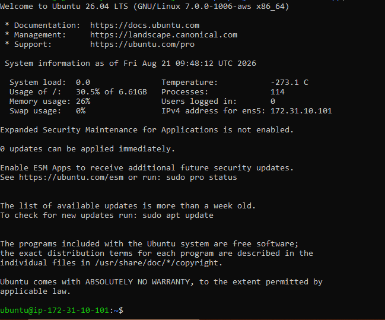
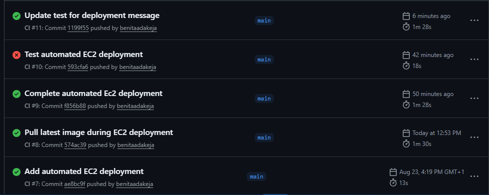
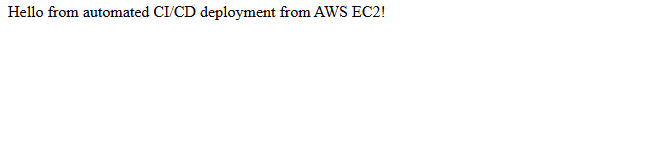

# Docker CI/CD App

A containerized Flask application with an automated CI/CD pipeline that tests, builds, publishes, and deploys Docker images from GitHub to an AWS EC2 instance.


---

## 📌 Project Overview

This project demonstrates a complete beginner-friendly **CI/CD workflow using Docker and GitHub Actions**.

The application is a simple Flask API with two endpoints:

* `/` — returns a welcome message
* `/health` — returns the application's health status

The application is:

1. Developed with Flask
2. Tested automatically with `pytest`
3. Containerized with Docker
4. Built automatically using GitHub Actions
5. Published to GitHub Container Registry (GHCR)
6. Deployed to an AWS EC2 instance
7. Automatically updated on EC2 whenever changes are successfully pushed through the CI/CD pipeline

The project demonstrates the progression from local development and containerization to a complete cloud deployment workflow, where a successful push to the `main` branch can automatically update the running application on AWS EC2.

---

## 🏗️ Architecture
```text
                         Developer
                             │
                             │ git push
                             ▼
                      GitHub Repository
                             │
                             ▼
                      GitHub Actions
                             │
                             ▼
                    Run automated tests
                             │
                      Tests must pass
                             │
                             ▼
                     Build Docker image
                             │
                             ▼
                       Push to GHCR
                             │
                             ▼
                GitHub Container Registry
                             │
                             │ SSH deployment
                             ▼
                       AWS EC2 Instance
                             │
                             ▼
                     Pull latest image
                             │
                             ▼
                  Stop old container
                             │
                             ▼
                 Remove old container
                             │
                             ▼
                   Start new container
                             │
                             ▼
                      Flask App :5000
                             │
                             ▼
                         Internet
---

## 🛠️ Technologies Used

| Technology                | Purpose                        |
| ------------------------- | ------------------------------ |
| Python 3.14               | Application runtime            |
| Flask 3.1.2               | Web framework                  |
| Pytest                    | Automated testing              |
| Docker                    | Application containerization   |
| Git                       | Version control                |
| GitHub                    | Source code hosting            |
| GitHub Actions            | CI/CD and deployment automation|
| GitHub Container Registry | Docker image storage           |
| AWS EC2                   | Cloud application hosting      |
| SSH                       | Secure remote deployment       |
| Ubuntu / WSL              | Development environment        |

---

## 📁 Project Structure
docker-cicd-app/
│
├── .github/
│   └── workflows/
│       └── ci.yml
│
├── app/
│   ├── __init__.py
│   ├── app.py
│   └── requirements.txt
│
├── tests/
│   └── test_app.py
│
├── images/
│   ├── browserupandrunning.png
│   ├── dockerbrowserhealth.png
│   ├── dockerbrowserrunning.png
│   ├── dockerbuildandimages.png
│   ├── dockerdetached.png
│   ├── dockerfile.png
│   ├── dockerlogs.png
│   ├── dockerps.png
│   ├── flaskupandrunning.png
│   ├── githubworkflows.png
│   ├── healthcheckconfirmed.png
│   ├── sshsuccessful.png
│   ├── successfulcicd.png
│   └── successfulpytest.png
│
├── .gitignore
├── Dockerfile
├── LICENSE
├── pytest.ini
└── README.md```

---

# 🐍 1. Flask Application

The application was built using Flask and exposes two routes.

### Home Route

```text
GET /
```

Returns:
```text
Hello from automated CI/CD deployment from AWS EC2!
```
### Health Check

```text
GET /health
```

Returns:

```json
{
  "status": "healthy"
}
```

The health endpoint provides a simple way to verify that the application is running correctly.

### Flask Application Running


---

# 🧪 2. Automated Testing

The application was tested using **pytest**.

Two tests were implemented:

* Testing the `/` route
* Testing the `/health` route

The tests verify both the HTTP status code and the expected response.

```python
def test_home_route():
    client = app.test_client()
    response = client.get("/")

    assert response.status_code == 200
    assert response.data.decode() == "Hello from automated CI/CD deployment from AWS EC2!"


def test_health_check():
    client = app.test_client()
    response = client.get("/health")

    assert response.status_code == 200
    assert response.json == {"status": "healthy"}
```
During the final deployment test, changing the application's home response caused the existing test to fail because it still expected the previous response.

Since the deployment job depends on the test job, GitHub Actions automatically prevented the updated application from being deployed until the test was corrected and passed successfully.

This demonstrated the role of automated testing as a deployment gate within the CI/CD pipeline.

Running:

```bash
pytest
```

produced:

```text
2 passed
```

### Successful Tests


---

# 🐳 3. Dockerization

The Flask application was packaged into a Docker image using a `Dockerfile`.

The Dockerfile:

* Uses Python 3.14 as the base image
* Creates `/app` as the working directory
* Copies the application files into the container
* Installs the Python dependencies
* Exposes port `5000`
* Starts the Flask application

### Dockerfile

```dockerfile
FROM python:3.14

WORKDIR /app

COPY app .

RUN pip install -r requirements.txt

EXPOSE 5000

CMD ["python", "app.py"]
```

### Dockerfile


---

## 🔨 Building the Docker Image

The image was built locally with:

```bash
sudo docker build -t docker-cicd-app .
```

The resulting image was then verified using:

```bash
sudo docker images
```


---

# 🚢 4. Running the Docker Container

The application was run as a detached Docker container with port mapping:

```bash
sudo docker run -d \
  --name docker-cicd-newapp \
  -p 5000:5000 \
  docker-cicd-app
```

The port mapping:

```text
5000:5000
```

means:

```text
Host Port 5000 → Container Port 5000
```

The running container was verified with:

```bash
sudo docker ps
```


The application was then accessed through:

```text
http://localhost:5000
```


---

# 🩺 5. Health Check Verification

The health endpoint was tested through the browser:

```text
http://localhost:5000/health
```

Expected response:

```json
{
  "status": "healthy"
}
```


The health check was also verified during container testing.


---

# 📋 6. Docker Logs

Docker logs were used to inspect the application's activity inside the container.

```bash
sudo docker logs docker-cicd-newapp
```

The logs confirmed successful requests to both the home route and the health endpoint.


---

# ⚙️ 7. GitHub Actions CI/CD

The project uses **GitHub Actions** to automate the CI/CD process.

The workflow is triggered whenever code is pushed to the `main` branch.

The pipeline performs the following steps:

```text
Checkout code
      ↓
Set up Python 3.14
      ↓
Install dependencies
      ↓
Run pytest
      ↓
Login to GitHub Container Registry
      ↓
Build Docker image
      ↓
Push Docker image to GHCR
```

### Workflow

The workflow is defined in:

```text
.github/workflows/ci.yml
```

The pipeline uses:

* `actions/checkout@v4`
* `actions/setup-python@v5`
* `docker/login-action@v3`
* `docker/build-push-action@v6`

The workflow also uses GitHub's automatically generated `GITHUB_TOKEN` rather than storing a personal password in the repository.

This keeps authentication credentials out of the source code.

---

# 📦 8. GitHub Container Registry

After the tests pass, GitHub Actions builds and publishes the Docker image to **GitHub Container Registry (GHCR)**.

The image is tagged as:

```text
ghcr.io/benitaadakeja/docker-cicd-app:latest
```

The image can then be pulled using:

```bash
docker pull ghcr.io/benitaadakeja/docker-cicd-app:latest
```

The image was successfully pulled from GHCR and run locally, confirming that the published image was usable outside the GitHub Actions runner.

---

# ☁️ 9. AWS EC2 Deployment

The Dockerized application was deployed to an **AWS EC2 instance** running Ubuntu 26.04 LTS.

The EC2 instance was configured with:

* Ubuntu 26.04 LTS
* `t3.micro` instance type
* Docker Engine
* SSH access using an EC2 key pair
* A security group allowing:
  * SSH traffic on port `22`
  * Application traffic on port `5000`

Docker was installed directly on the EC2 instance using Docker's official Ubuntu repository.

The application image was then pulled from GitHub Container Registry:

```bash
docker pull ghcr.io/benitaadakeja/docker-cicd-app:latest
```

The container was initially started manually to verify that the application worked correctly on the server:

```bash
docker run -d \
  --name docker-cicd-app \
  -p 5000:5000 \
  ghcr.io/benitaadakeja/docker-cicd-app:latest
```

The application was first verified from inside the EC2 instance using:

```bash
curl http://localhost:5000
```

It was then successfully accessed externally through the EC2 instance's public IP address on port `5000`.

# 🔐 10. SSH Deployment Authentication

A dedicated SSH key pair was created specifically for GitHub Actions deployment.

This kept automated deployment access separate from the personal EC2 SSH key used for manual administration.

The deployment public key was added to the EC2 instance's:

```text
~/.ssh/authorized_keys
```

The corresponding private key was stored securely as a GitHub repository secret.

The following repository secrets were configured:

```text
EC2_SSH_PRIVATE_KEY
EC2_HOST
EC2_USER
```

GitHub Actions uses these values to authenticate with the EC2 instance without storing the private SSH key directly in the repository or workflow file.

### Successful SSH Connection



# 🚀 11. Automated Deployment to EC2

The GitHub Actions workflow was extended with a dedicated `deploy` job that runs only after the CI job completes successfully.

The dependency is configured using:

```yaml
deploy:
  needs: test
```

This ensures that a failed test prevents the application from being deployed.

The deployment job:

1. Configures the SSH private key on the GitHub Actions runner
2. Adds the EC2 host to the runner's known hosts
3. Connects to the EC2 instance through SSH
4. Pulls the latest Docker image from GHCR
5. Stops the currently running application container
6. Removes the old container
7. Starts a new container using the latest image

The deployment commands executed remotely on EC2 are:

```bash
docker pull ghcr.io/benitaadakeja/docker-cicd-app:latest
docker stop docker-cicd-app || true
docker rm docker-cicd-app || true
docker run -d \
  --name docker-cicd-app \
  -p 5000:5000 \
  ghcr.io/benitaadakeja/docker-cicd-app:latest
```

The `|| true` statements allow the deployment to continue if an existing container is already stopped or does not exist.

### Successful CI/CD Workflow



# 🌍 12. End-to-End Deployment Verification

The completed pipeline was tested by changing the Flask application's home response and pushing the change to the `main` branch.

The first deployment attempt was automatically blocked because the existing test still expected the previous application response. After updating the test and pushing the correction, the complete pipeline ran successfully.

The final workflow was:

```text
Code change
     ↓
Git push to main
     ↓
GitHub Actions triggered
     ↓
Automated tests
     ↓
Tests must pass
     ↓
Docker image built
     ↓
Image pushed to GHCR
     ↓
Deployment job started
     ↓
SSH connection to AWS EC2
     ↓
Latest image pulled
     ↓
Old container stopped and removed
     ↓
New container started
     ↓
Updated application available on port 5000
```

The updated application response was:

```text
Hello from automated CI/CD deployment from AWS EC2!
```

The new version became available on the EC2-hosted application without manually connecting to the server to perform the deployment.

### Successful Automated Deployment



This confirmed that a successful `git push` could trigger the complete CI/CD process from automated testing through cloud deployment.

---

# 🎯 What I Learned

Through this project, I gained hands-on experience with:

* Building a Flask application
* Writing automated tests with pytest
* Creating Dockerfiles
* Building Docker images
* Running and managing Docker containers
* Docker port mapping
* Inspecting container logs
* Using Docker Exec to inspect running containers
* Understanding Docker images vs containers
* Git repository initialization and branching
* GitHub repository management
* GitHub Actions workflows
* CI pipeline configuration
* Docker image builds in CI
* GitHub Container Registry
* Secure authentication with `GITHUB_TOKEN`
* Publishing and pulling container images
* End-to-end CI/CD verification
* Launching and configuring an AWS EC2 instance
* Connecting securely to EC2 using SSH
* Installing and configuring Docker on a cloud server
* Deploying Docker images from GHCR to EC2
* Managing EC2 security group rules
* Creating a dedicated SSH key for automated deployments
* Managing deployment credentials with GitHub Secrets
* Creating dependent jobs in GitHub Actions using `needs`
* Using automated tests as a deployment gate
* Running Docker commands remotely through GitHub Actions
* Automatically replacing running containers with updated images
* Building an end-to-end CI/CD pipeline from Git push to cloud deployment

---
# 🚀 Future Improvements

Possible improvements to this project include:

* Use a production WSGI server such as Gunicorn
* Add more comprehensive application tests
* Add Docker image versioning based on Git commit SHA or releases
* Add Docker image vulnerability scanning
* Configure HTTPS with a domain name and reverse proxy
* Implement zero-downtime or rolling deployments
* Add automated deployment rollback if a new container fails
* Add deployment health checks before considering a release successful
* Pin and verify the EC2 SSH host key instead of relying on `ssh-keyscan`
* Use a more secure deployment approach that avoids exposing SSH port `22` broadly to GitHub-hosted runners
* Add deployment notifications and monitoring
---

## 👩🏽‍💻 Author

**Benita Oyinkansola Adakeja**

Computer Science Student | Data & Cloud | DevOps Learner

GitHub: [@benitaadakeja](https://github.com/benitaadakeja)

---

## ⭐ Project Status

**Completed ✅**
## ⭐ Project Status

**Completed ✅**

The application has been tested, containerized, integrated with GitHub Actions, published to GitHub Container Registry, and deployed to AWS EC2.

The completed CI/CD pipeline automatically tests changes, builds and publishes an updated Docker image, connects to the EC2 instance, pulls the latest image, and replaces the running container after successful pushes to the `main` branch.

An end-to-end deployment test confirmed that application changes could move from a local `git push` to the live AWS-hosted application without requiring a manual deployment on the server.
